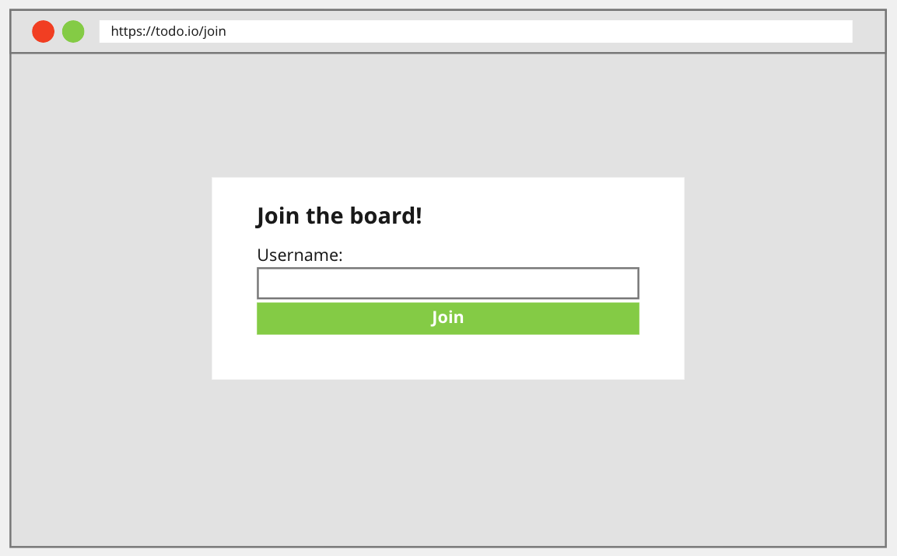
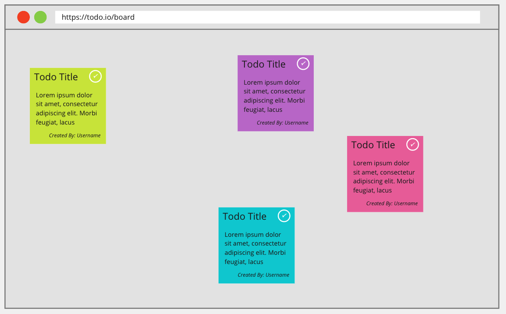
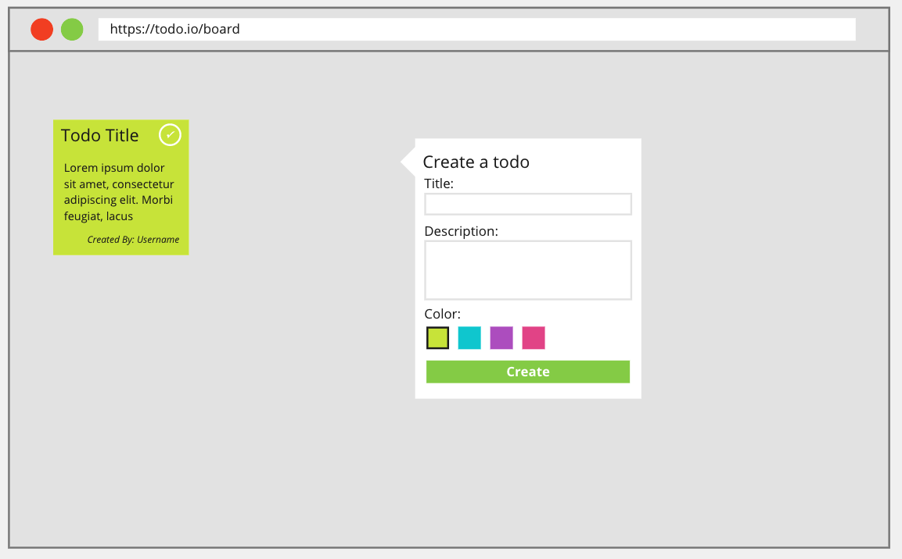

# Coding Challenge

The coding challenge for this role is to build a small application called Todo.io, which is a todo app with a multiplayer twist!

Todo.io will allow users to around the world to add tasks to a shared todo board and allow users to mark any task on the board as complete. Perhaps a flawed app concept in practice, but a fun challenge to solve none the less.

## Step 1 - Copy the repo

Use this repo as the starting point for your project. Forking is disabled, so you will have to clone the repo and upload it to GitHub as you make changes.

Share the link to your repo when you are ready to submit your challenge!

## Step 2 - Build the app

We have included some scaffolding and structure to help you get started, but feel free to alter and change this to suit your preferred languages/frameworks.

To run the app, first install the dependencies:

``npm install``

Then run:

``npm run dev``

The url for the app will be in the console.

### Requirements

The app is fairly simple. Upon visiting the site, the user is presented with a screen that asks them for a username.

Once the user has provided a username and clicked join, they are taken to the board page, where they can see the todos that are currently on the board.

Clicking on the tick icon on a todo will remove it from the board (as well as remove it for all users currently viewing the board), clicking on the background will open up the "Create Todo" popover

Once the user fills in the details of the todo and clicks create, the todo will appear for the user and any other users viewing the board.
The position of the todo will be located at the original location the user clicked on in the background.

## Step 3 - Design doc

During implementing this app, you might have thought of areas for improvement or new features that you would like to add.
The final step of this challenge is to write a design doc for your new feature or improvement, so that another developer can take on the work.

If you are unfamiliar with what a design doc is, in essence it is the **why** and **how** of a piece of work that a developer can pick up and implement with all the engineering problem-solving done up front as part of the design doc.
Nuclino has a good write-up on design documents: https://www.nuclino.com/articles/software-design-document

Put your design doc in the docs folder in the root of this project. Try to limit the document to no more than an A4 piece of paper