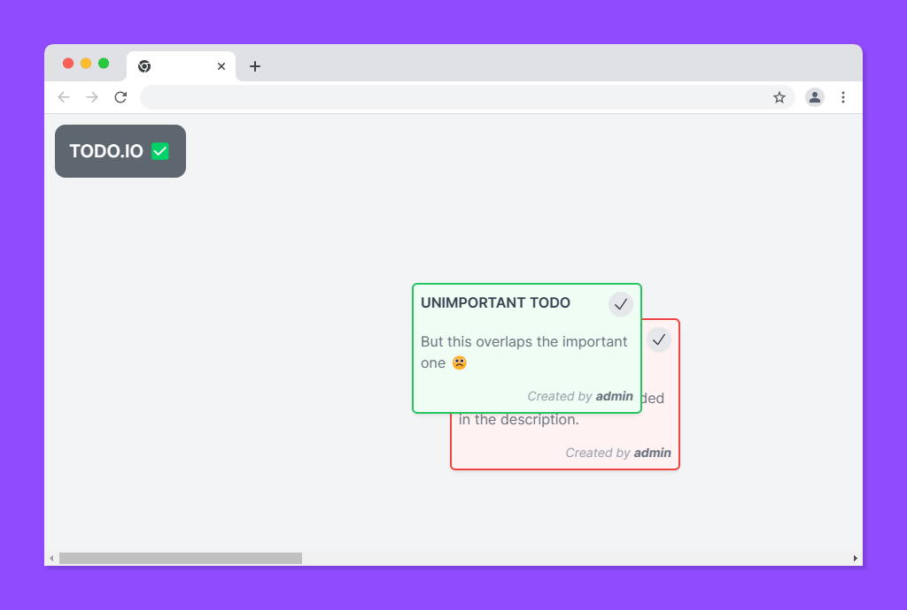
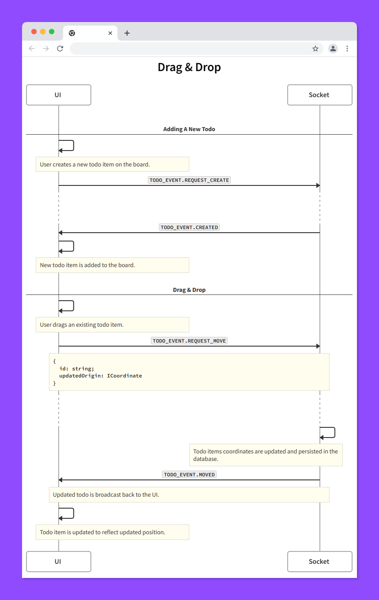
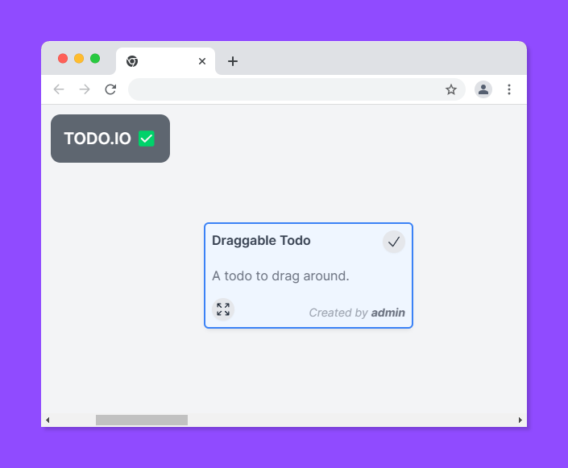

# Design Document: Drag and Drop

## Overview & Goal

Adding the ability to drag and drop existing todo items to a new position on the board. This will help users arrange their todo items in a way that makes sense to them as well as being able to avoid overlapping todo items.

> 🎯🎯🎯 Our target: To allow users to move existing todo items.

## Current problem

Currently, the only way to move a todo item is to delete it and create a new one. This is not user friendly and can be frustrating for users who want to move an item to a different position on the board. Users are able to create todo items that overlap each other which can be confusing and blocks them from being able to view the todo item they want to.





## Proposed solution

[View the swimlane](https://swimlanes.io/d/IaAJ7Z3Xr)



To support the new drag and drop functionality we require two new events:

- `TODO_EVENT.REQUEST_MOVE`
- `TODO_EVENT.MOVED`

A helper library exists for this functionality which will make the addition of drag and drop fairly simple: [VueUse](https://vueuse.org/core/useDraggable) is a popular and well maintained open source library that provides common functionality for Vue 3.

```ts
<script setup lang="ts">
import { ref } from 'vue'
import { useDraggable } from '@vueuse/core'

const el = ref<HTMLElement | null>(null)

const { style } = useDraggable(draggable, {
    initialValue: { ...props.todo.coordinates },
    handle: dragIcon, // Element to allow dragging
    onEnd: (position: Position) => {
        // Use the updated todo position (x, y)
    }
});
</script>

<template>
  <div ref="el" :style="style">
    ...
    <div ref="dragIcon">
      // Use me to drag
    </div>
  </div>
</template>
```
# UI

The user should be able to drag each todo item by holding their mouse button down on the drag icon and moving the mouse to the desired position. The todo item should be able to be dragged to any position on the board and remain in that position when the board is reloaded.



